<a id="readme-top"></a>

<div align="center">
  <a href="https://github.com/realYushi/todo-list">
    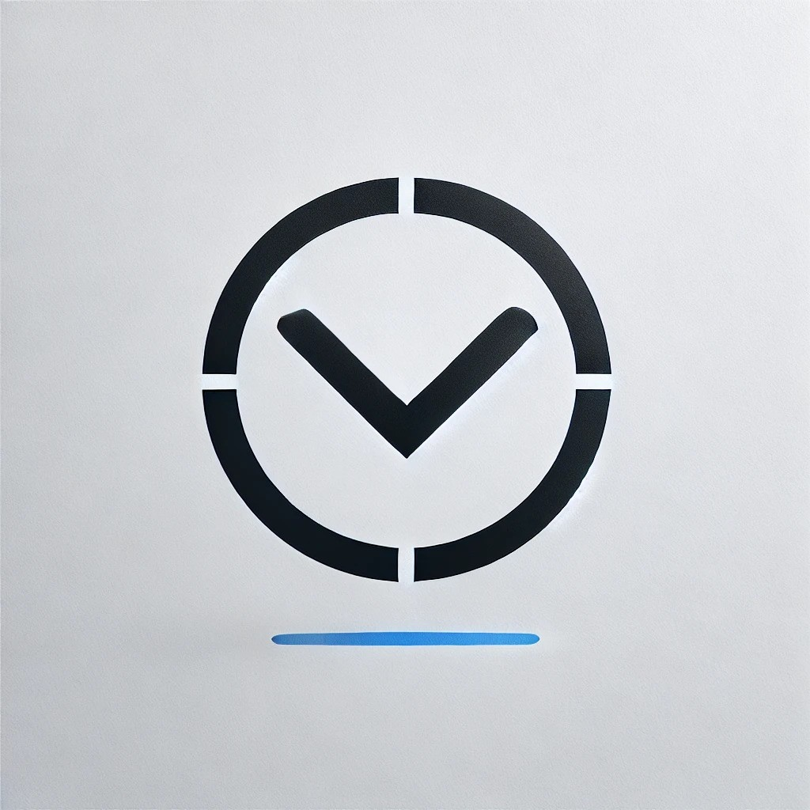
  </a>

<h3 align="center">ToDo List Application</h3>

  <p align="center">
    A comprehensive, full-stack ToDo List application designed with a mobile-first approach.
    <br />
    <a href="https://github.com/realYushi/todo-list"><strong>Explore the docs »</strong></a>
    <br />
    <br />
    <a href="https://todo.yushi91.com">View Demo</a>
    ·
    <a href="https://github.com/realYushi/todo-list/issues/new?labels=bug&template=bug-report---.md">Report Bug</a>
    ·
    <a href="https://github.com/realYushi/todo-list/issues/new?labels=enhancement&template=feature-request---.md">Request Feature</a>
  </p>
</div>

<details>
  <summary>Table of Contents</summary>
  <ol>
    <li>
      <a href="#about-the-project">About The Project</a>
      <ul>
        <li><a href="#built-with">Built With</a></li>
      </ul>
    </li>
    <li>
      <a href="#getting-started">Getting Started</a>
      <ul>
        <li><a href="#prerequisites">Prerequisites</a></li>
        <li><a href="#installation">Installation</a></li>
      </ul>
    </li>
    <li><a href="#usage">Usage</a></li>
    <li><a href="#roadmap">Roadmap</a></li>
    <li><a href="#contributing">Contributing</a></li>
    <li><a href="#license">License</a></li>
    <li><a href="#contact">Contact</a></li>
  </ol>
</details>

## About The Project

This repository contains the code for a comprehensive, full-stack ToDo List application. It's designed with a mobile-first approach, ensuring a seamless experience across all platforms. Users can register and log in with their unique username and password, allowing them to access their data from any device. The app offers robust user authentication, including the ability to update passwords.

Key features of the ToDo List app include:

-   List Management: Users can create, update, and organize lists, which serve as group units for tasks. Each list has a title and an optional description.
-   Task Creation: Within each list, users can create tasks with customizable titles and descriptions.
-   Due Date Functionality: Tasks can have optional due dates. When a due date passes, the task automatically enters an overdue status.
-   Flexible Task Management: Users can modify task titles, descriptions, and due dates, or remove due dates entirely.
-   Dashboard: A comprehensive dashboard provides an overview of the user's productivity, displaying total task count, completed tasks, pending tasks, and overdue items.
    |Feature|Desktop|Mobile|
    |---|---|---|
    |Theme|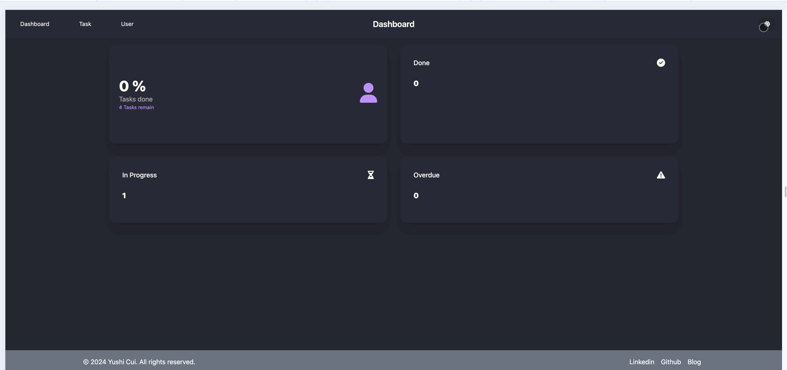|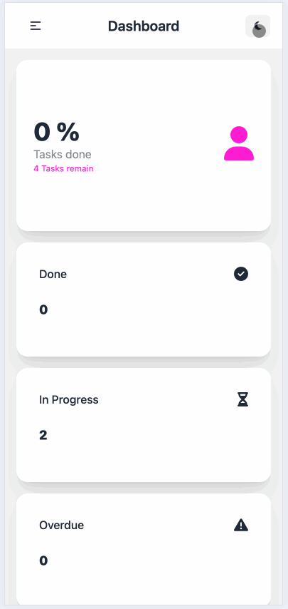|
    |List Management|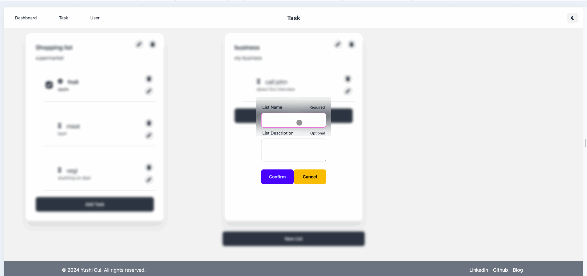|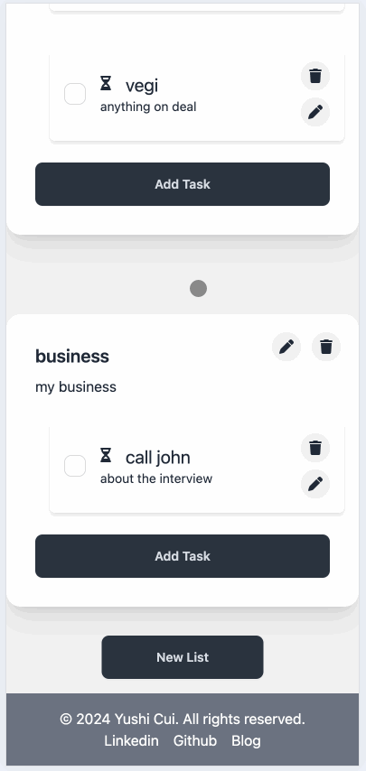|
    |Task Management||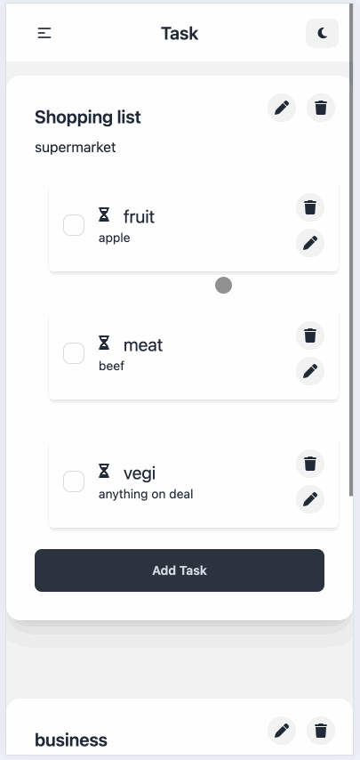|
    |Dashboard|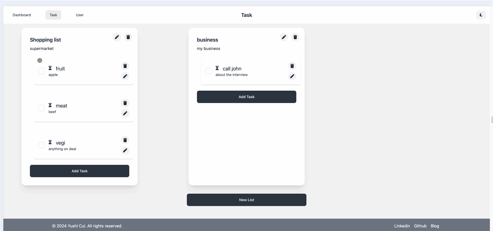|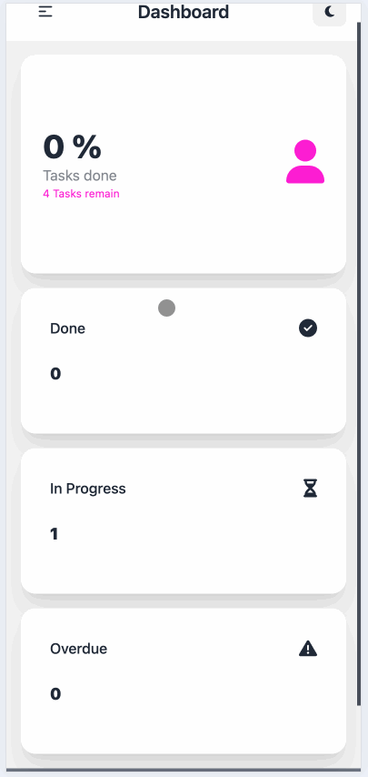|
    |User Authentication|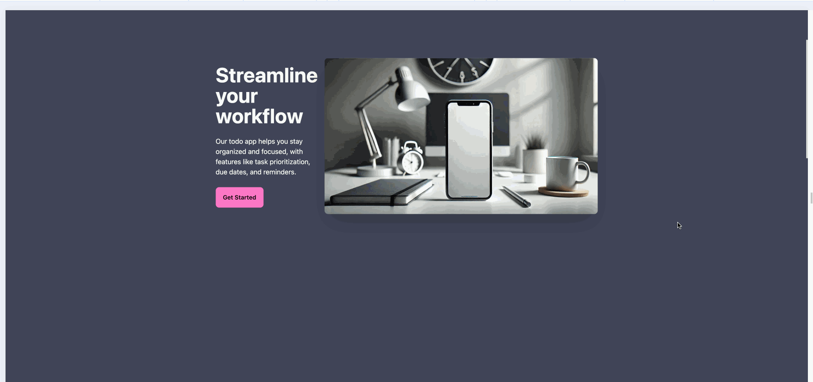|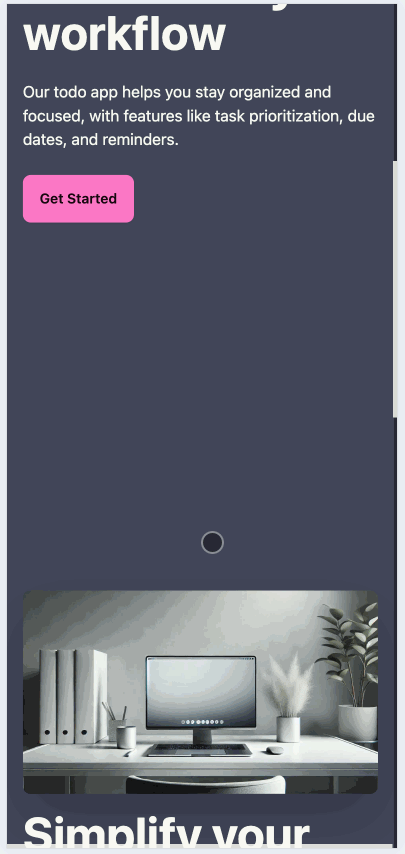|\
    |Password Management|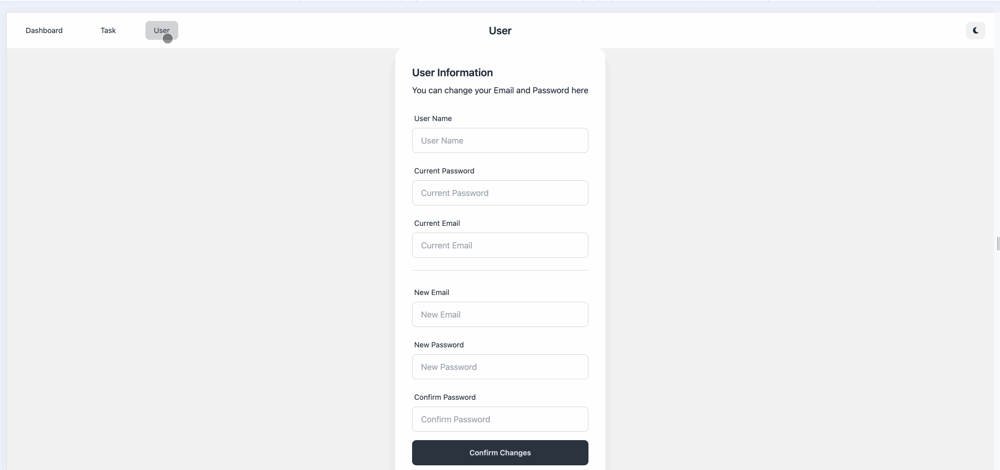|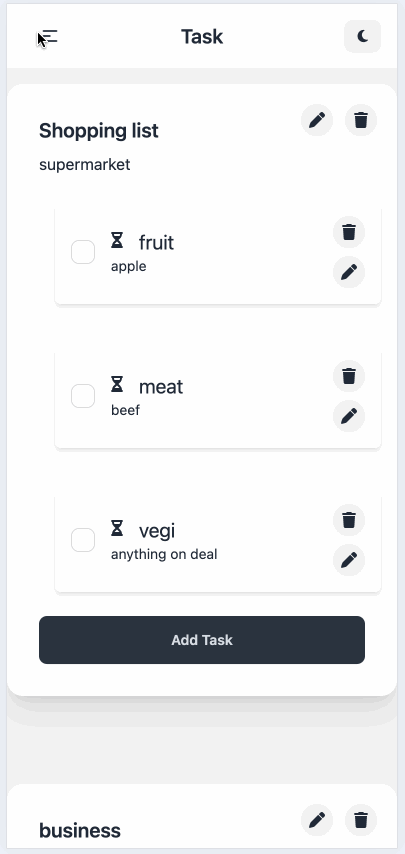|
    |Responsive Design|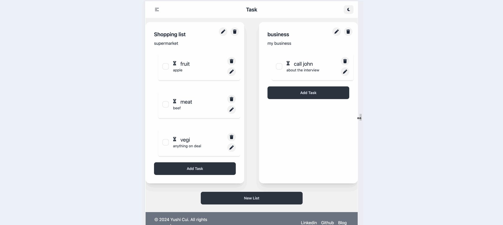||

This application showcases modern web development practices, incorporating React, .NET, SQL, and WebSockets. It's being developed using test-driven development (TDD) methodologies, and is fully containerized using Docker.

<p align="right">(<a href="#readme-top">back to top</a>)</p>

### Built With

-   [![React][React.js]][React-url]
-   [![.NET][.NET]][.NET-url]
-   [![SQL Server][SQL Server]][SQL Server-url]
-   [![Docker][Docker]][Docker-url]
-   [![TypeScript][TypeScript]][TypeScript-url]
-   [![Redux][Redux]][Redux-url]
-   [![Tailwind][Tailwind CSS]][Tailwind-url]
-   [![Azure][Azure]][Azure-url]

<p align="right">(<a href="#readme-top">back to top</a>)</p>

## Getting Started

The ToDo List application is live and ready to use! You can access it directly at:

[https://todo.yushi91.com](https://todo.yushi91.com)

Simply visit the URL to start using the application. You can create an account, log in, and begin managing your tasks right away.(Due to the cost of the server, the database may need 30 seconds to wake up)

### Prerequisites

For developers interested in running the project locally:

-   Git
-   Docker

### Installation

1. Clone the repo
    ```sh
    git clone https://github.com/realYushi/todo-list.git
    ```
2. Navigate to the project directory

    ```sh
    cd todo-list
    ```

3. Copy the `.env.example` file to `.env`

```sh
    cp .env.example .env
```

4. Edit the `.env` file and replace the placeholder values with your actual configuration.
    > **Note:** If you don't set up a `.env` file or don't define all variables, the project will use the default values specified in the `docker-compose.yml` file.
5. Run the application using Docker Compose
    ```sh
    make up
    ```
6. Access the application in your browser(start with HTTPS)

```sh
    https://localhost
```

  <p align="right">(<a href="#readme-top">back to top</a>)</p>

## Usage

Use this space to show useful examples of how the project can be used. Additional screenshots, code examples and demos work well in this space.

<p align="right">(<a href="#readme-top">back to top</a>)</p>

## Roadmap

-   [x] User Authentication
-   [x] List Management
-   [x] Task Creation and Management
-   [x] Dashboard
-   [ ] Asynchronous Updates
-   [ ] Notifications
-   [ ] Tags
-   [ ] Search
-   [ ] AI Integration
-   [ ] Collaboration Features

See the [open issues](https://github.com/realYushi/todo-list/issues) for a full list of proposed features (and known issues).

<p align="right">(<a href="#readme-top">back to top</a>)</p>

## Contributing

Since this is a personal project, contributing is currently not open. However, any feedback or suggestions are welcome. Please feel free to reach out to me.

<p align="right">(<a href="#readme-top">back to top</a>)</p>

## License

Distributed under the MIT License. See `LICENSE.txt` for more information.

<p align="right">(<a href="#readme-top">back to top</a>)</p>

## Contact

Yushi Cui - realYushi@gmail.com

Project Link: [https://github.com/realYushi/todo-list](https://github.com/realYushi/todo-list)

Blog: [https://blog.yushi91.com](https://blog.yushi91.com)

LinkedIn: [https://www.linkedin.com/in/yushi-cui-6043aa285/](https://www.linkedin.com/in/yushi-cui-6043aa285)

<p align="right">(<a href="#readme-top">back to top</a>)</p>

[React.js]: https://img.shields.io/badge/React-20232A?style=for-the-badge&logo=react&logoColor=61DAFB
[React-url]: https://reactjs.org/
[.NET]: https://img.shields.io/badge/.NET-5C2D91?style=for-the-badge&logo=.net&logoColor=white
[.NET-url]: https://dotnet.microsoft.com/
[SQL Server]: https://img.shields.io/badge/Microsoft%20SQL%20Server-CC2927?style=for-the-badge&logo=microsoft%20sql%20server&logoColor=white
[SQL Server-url]: https://www.microsoft.com/en-us/sql-server
[Docker]: https://img.shields.io/badge/Docker-2496ED?style=for-the-badge&logo=docker&logoColor=white
[Docker-url]: https://www.docker.com/
[TypeScript]: https://img.shields.io/badge/TypeScript-007ACC?style=for-the-badge&logo=typescript&logoColor=white
[TypeScript-url]: https://www.typescriptlang.org/
[Redux]: https://img.shields.io/badge/Redux-593D88?style=for-the-badge&logo=redux&logoColor=white
[Redux-url]: https://redux.js.org/
[Tailwind CSS]: https://img.shields.io/badge/Tailwind_CSS-38B2AC?style=for-the-badge&logo=tailwind-css&logoColor=white
[Tailwind-url]: https://tailwindcss.com/
[Azure]: https://img.shields.io/badge/Azure-0089D6?style=for-the-badge&logo=microsoft-azure&logoColor=white
[Azure-url]: https://azure.microsoft.com/
[product-screenshot]: Images/screenshot.png
